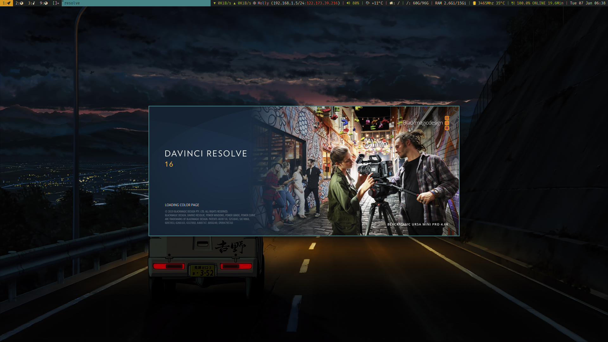
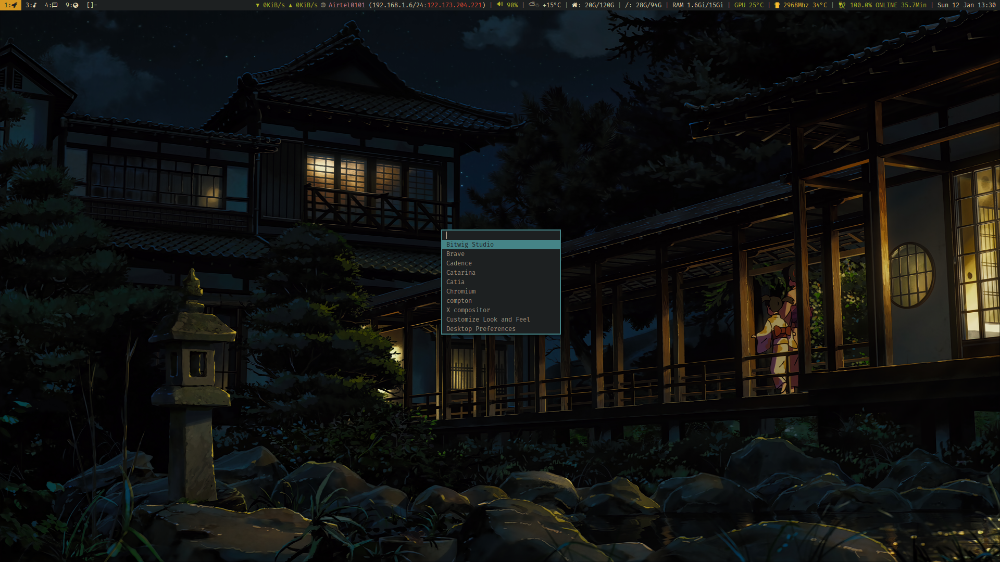
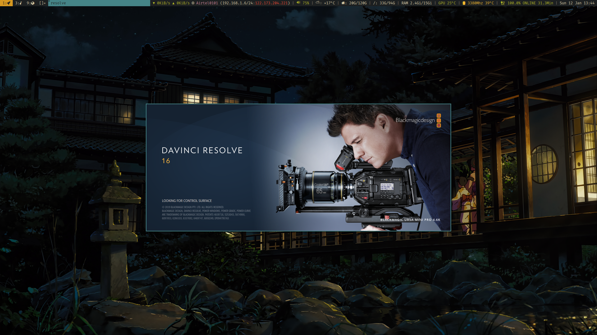

karman's configs
=================

## programs used:

#### to compile dwm and st
+ libX11-devel
+ libXft-devel
+ libXinerama-devel

#### for my dwm status bar (dwm with status2d patch)
+ xsetroot
+ apcupsd (for my APC ups status)
+ nmcli
+ nvidia-smi (for gpu temperature)

#### everything else
+ setxkbmap
+ xautolock
+ xset
+ xsel
+ xclip
+ polkit-gnome
+ geoclue2
+ sxhkd
+ numlockx
+ clipmenud
+ unclutter
+ redshift
+ feh
+ picom
+ mpd
+ ncmpcpp
+ dunst
+ tmux
+ zsh (add `ZDOTDIR="$HOME/.config/zsh"` to /etc/zsh/zshenv for cleaner setup)
+ dash
+ exa
+ gotop
+ htop
+ zathura
+ mpv
+ nerd-fonts
+ networkmanager-dmenu
+ neovim (with [vim-plug](https://github.com/junegunn/vim-plug))
+ ranger
+ ueberzug
+ [j4-dmenu-desktop](https://github.com/enkore/j4-dmenu-desktop)
+ irssi
+ pcmanfm-qt

uses [stow](https://www.gnu.org/software/stow/) for managing dotfiles.

> usage: `stow zsh dwm mpd (etc)`
